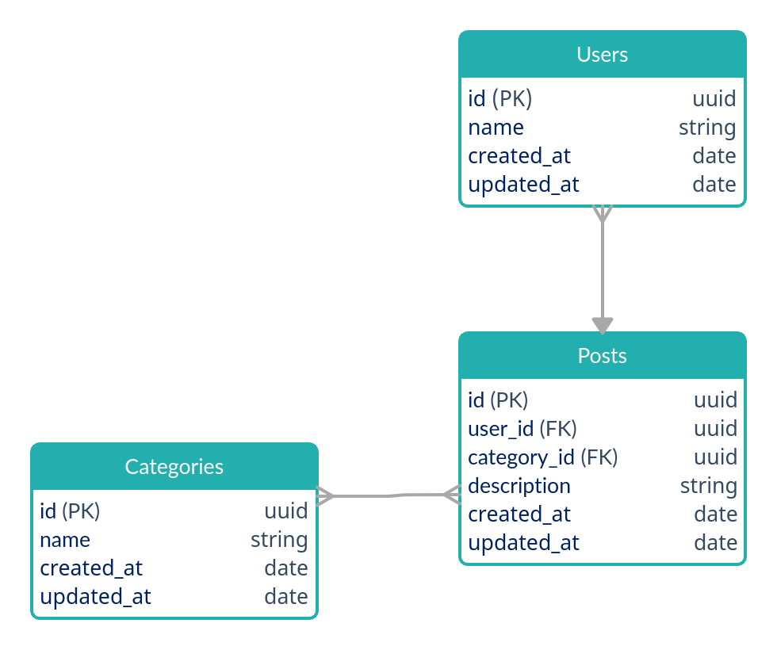

<h1 align="center">API Node.js para Blog</h1>

## Tecnologias

- [ESLint e Prettier](https://www.notion.so/ESLint-e-Prettier-Trilha-Node-js-d3f3ef576e7f45dfbbde5c25fa662779)
- [commitlint](https://commitlint.js.org/)
- [husky](https://yarnpkg.com/package/husky)
- [Express](https://expressjs.com/)
- [TypeScript](https://www.typescriptlang.org/)
- [ts-node-dev](https://yarnpkg.com/package/ts-node-dev)
- [Docker](https://www.docker.com/)
- [Docker Compose](https://docs.docker.com/compose/)
- [TypeORM](https://typeorm.io/)
- [TSyringe](https://github.com/microsoft/tsyringe)
- [Jest](https://jestjs.io/)

## Iniciar projeto via Docker

### Criar e iniciar configurações

`docker-compose up`

### Iniciar serviços

`docker-compose start`

### logs

`docker logs SERVICE -f`

### Para serviços

`docker-compose stop`

### Para e remover as configurações

`docker-compose down`

---

## Diagramação

---

## Migrações

### Para criar

`yarn typeorm migration:generate -n PostRefactoring`

### Para executar

`yarn typeorm migration:run`

### Para reverter

`yarn typeorm migration:run`